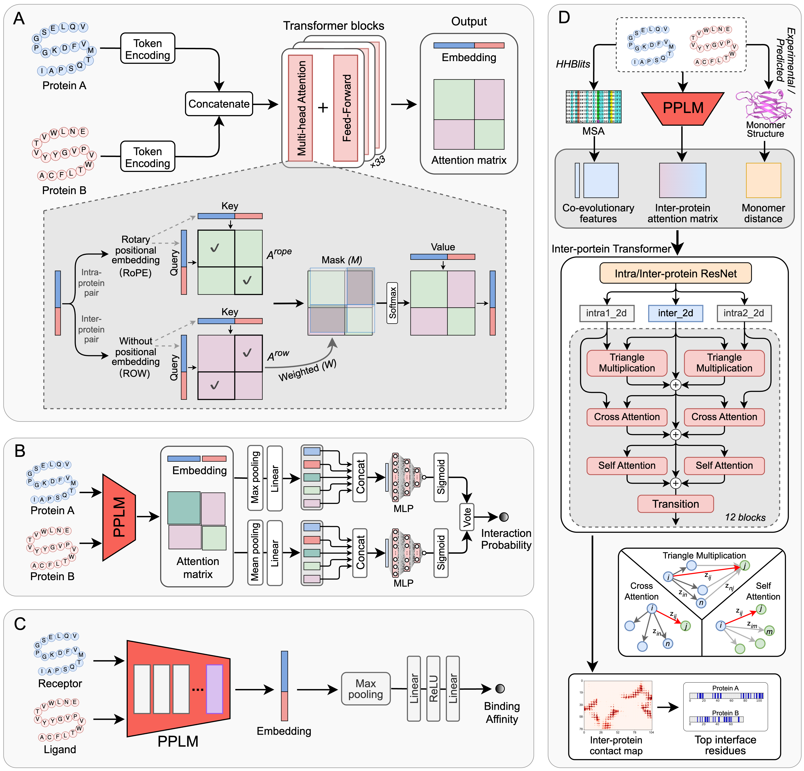

# PPLM: A Corporative Language Model for Protein-Protein Interaction, Binding Affinity, and Interface Contact Prediction



---

**Version 1.0, 03/25/2025**  
(Copyrighted by the Regents of the National University of Singapore, All rights reserved)

PPLM is a protein–protein language model that learns directly from paired sequences through a novel
attention architecture, explicitly capturing inter-protein context. Building on PPLM, we developed
PPLM-PPI, PPLM-Affinity, and PPLM-Contact for predicting protein–protein interactions, estimating
binding affinity, and identifying interface residue contacts, respectively.

**Authors**: Jun Liu, Hungyu Chen, and Yang Zhang

**Contact**: junl_sg@nus.edu.sg

**License**: PolyForm Noncommercial License
<!--
**Webserver**: [PPLM Online Submission](https://zhanggroup.org/PPLM/)  
-->
**Citation**:  
Liu, Jun, Hungyu Chen, and Yang Zhang. "A Corporative Language Model for Protein–Protein Interaction, Binding Affinity, and Interface Contact Prediction." bioRxiv (2025): 2025-07. [link](https://www.biorxiv.org/content/10.1101/2025.07.07.663595v1)

---

## System Requirements
- x86_64 machine
- Linux Kernel OS

## Software & Dataset Requirements (for PPLM-Contact)
1. **HH-suite3** for MSA Search: Install [HH-suite3](https://github.com/soedinglab/hh-suite) and update the "hhsuite_dir" parameter in the "pplm_contact/config.py" file.
2. **Uniclust Database**: Download the [Uniclust30 database](http://wwwuser.gwdg.de/~compbiol/uniclust/2021_03/), unzip it on your machine, and update the "UniRef_database" parameter in the "pplm_contact/config.py" file.
3. **CCMpred** for DCA: Install [ccmpred](https://github.com/soedinglab/CCMpred), or use the pre-packaged version in the "pplm_contact/external_tools" directory. Set the "ccmpred" parameter in the "pplm_contact/config.py" file. You may need to grant permission by running 'chmod +x pplm_contact/external_tools/ccmpred'.
4. **LoadHHM** for PSSM Calculation: Download [LoadHHM.py](https://github.com/j3xugit/RaptorX-Contact/blob/master/Common/LoadHHM.py) and place the file in the "pplm_contact" directory of the PPLM package, or use the pre-packaged version within the "pplm_contact" directory.
5. **ESM-MSA** for Feature Generation: Install the [ESM package](https://github.com/facebookresearch/esm), or use the pre-packaged version within "pplm_contact/external_tools" directory. Download the pre-trained [ESM-MSA model](https://dl.fbaipublicfiles.com/fair-esm/models/esm_msa1_t12_100M_UR50S.pt) and set the "esm_msa_model" parameter in the "pplm_contact/config.py" file. 

## Download parameters
You can download the pre-trained weights for PPLM and its downstream models from the links below and place them in the weights/ directory:<br>
1. **PPLM**: [pplm_weights](https://drive.google.com/file/d/1Xdb3SG0CRY49WqH4jUJhM-yqsLOejz7_/view?usp=share_link)<br>
2. **PPLM-PPI**: [pplm-ppi_weights](https://drive.google.com/file/d/1QxSFXojCQmLzgrTz398lUEdIZmqVVV9E/view?usp=share_link)<br>
3. **PPLM-Affinity**: [pplm-affinity_weights](https://drive.google.com/file/d/1teZBp3m_OQ4nciTmiepUDP8p9BXoVEwa/view?usp=drive_link)<br>
4. **PLM-Contact**: [pplm-contact_weights](https://drive.google.com/file/d/1SSEkfyiwtUVO4ZSN10HC5T2v-EGOHXle/view?usp=share_link)<br>
5. **PLM-Contact2**: [pplm-contact2_weights](https://drive.google.com/file/d/1s99QyTYjngRUUpy8VXJPhTXYHwmw9agp/view?usp=share_link)<br>
<!--
After downloading, please move each parameters to the corresponding directory: models/ under pplm/, pplm_ppi/, pplm_affinity/, and pplm_contact/.
-->
<!--
Run the download_parameter.sh script located in the models/ folder of pplm/, pplm_ppi/, pplm_affinity/, and pplm_contact/
```bash
cd pplm/models/ && bash download_model.sh
```
```bash
cd pplm_ppi/models/ && bash download_model.sh
```
```bash
cd pplm_affinity/models/ && bash download_model.sh 
```
```bash
cd pplm_contact/models/ && bash download_model.sh
```
-->
---

## Usage

### 1. Install environment
```bash
conda env create -f environment.yml
```
### 2. Activate environment
```bash
conda activate PPLM
```
### 3. Run PPLM-PPI
```bash
python run_pplm-ppi.py example/seq1.fasta example/seq2.fasta
```
You can also run PPLM-PPI for two individual sequences:
```bash
python pplm_ppi/predict.py example/seq1.fasta example/seq2.fasta
```
### 4. Run PPLM-Affinity
```bash
python run_pplm-affinity.py example/receptor.fasta example/ligand.fasta
```
### 5. Run PPLM-Contact
For homodimer
```bash
python run_pplm-contact.py example/protein.pdb example/protein.pdb example/homo_example
```
For heterodimer
```bash
python run_pplm-contact.py example/protein1.pdb example/protein2.pdb example/hetero_example
```
### 6. Run PPLM-Contact2
For homodimer
```bash
python run_pplm-contact2.py example/homodimer.afm.pdb example/homodimer.af3.pdb example/homodimer.dmf.pdb example/homo_example2
```
For heterodimer
```bash
python run_pplm-contact2.py example/heterodimer.afm.pdb example/heterodimer.af3.pdb example/heterodimer.dmf.pdb example/hetero_example2
```
### 7. Generate embeddings and attention matrices for other applications
```bash
python run_pplm.py example/seq1.fasta example/seq2.fasta example/seq1-seq2.pplm.pkl
```

## Example Outputs

### PPLM-PPI
- Command:
```bash
python python run_pplm-ppi.py example/seq1.fasta example/seq2.fasta
```
- Output: Predicted interaction probability printed to the command line：
```
Predicted interaction score: 0.9431089
```
<!---
```bash
python run_pplm-ppi.py example/seq_pairs.fasta example/seq_pairs.results
```
- Output: The predicted interaction probabilities are saved in example/seq_pairs.results:
```
>10090.ENSMUSP00000085394:10090.ENSMUSP00000116785
0.001926
>10090.ENSMUSP00000043111:10090.ENSMUSP00000102211
0.991765
>10090.ENSMUSP00000134644:10090.ENSMUSP00000131939
0.000425
>10090.ENSMUSP00000104648:10090.ENSMUSP00000095136
0.060997
>10090.ENSMUSP00000131855:10090.ENSMUSP00000118766
0.004577
>10090.ENSMUSP00000008036:10090.ENSMUSP00000046016
0.929329
...

Each entry consists of:
• Protein Pair: Represented in the format >Protein1:Protein2.
• Interaction Probability: The likelihood of interaction between the given protein pair.
```
-->

### PPLM-Affinity
- Command:
```bash
python run_pplm-affinity.py example/receptor.fasta example/ligand.fasta
```
- Output: Predicted binding affinity printed to the command line：
```
Predicted binding affinity: -7.6090136
```

### PPLM-Contact
- Command:
```bash
python run_pplm-contact.py example/protein.pdb example/protein.pdb example/homo_example
```
- Output: The predicted contacts are saved in example/homo_example/homo_example.pred_contact.txt:
```
Format:
Rank      ResIdx1   ResType1  ResIdx2   ResType2  Contact_Probability
1         23:A      MET       26:B      CYS       0.976151
2         26:A      CYS       23:B      MET       0.974481
3         22:A      ILE       26:B      CYS       0.971633
4         23:A      MET       30:B      GLN       0.971191
5         30:A      GLN       22:B      ILE       0.970514
6         27:A      GLY       23:B      MET       0.970334
7         22:A      ILE       30:B      GLN       0.970124
8         30:A      GLN       23:B      MET       0.96919
9         23:A      MET       27:B      GLY       0.966725
10        23:A      MET       23:B      MET       0.966512
...
```

### Troubleshooting (MKL and libperl.so)
On some systems, users may encounter `MKL`- or `libperl.so`-related errors due to local library and environment differences. We recommend installing PPLM in a fresh conda environment using the provided `environment.yml`:
```bash
conda create -n pplm python=3.10
conda activate pplm
conda env update -n pplm -f environment.yml
```
If MKL errors persist (e.g. import errors for numpy/pytorch), please try reinstalling MKL or recreating the environment:
```
conda install mkl
```
If you see an error about libperl.so not found when running PPLM-Contact or PPLM-Contact2, first ensure perl is installed and that the library path is visible:
```
conda install -c conda-forge perl
ls $CONDA_PREFIX/lib | grep libperl
cd $CONDA_PREFIX/lib
ln -s libperl.so.5.xx libperl.so   # replace with the actual version
export LD_LIBRARY_PATH="$CONDA_PREFIX/lib:$LD_LIBRARY_PATH"
```
